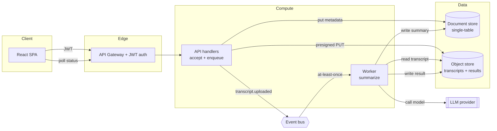

# 02 · Architecture

**In one paragraph.** Recapp is an event-driven, serverless system with four moving parts — a React app, a thin API, an async worker, and shared storage — plus one external LLM. The API's only job on a write is to *accept and enqueue*; a durable event bus hands the work to the worker; the worker owns the slow, failable summarization. A shared `core` package holds the business logic both the API and the worker import, so behavior stays consistent across the two runtimes.

## Component diagram

## The pieces

| Component | Responsibility | Must NOT do |
|-----------|----------------|-------------|
| **React SPA** (`web/`) | Auth, upload UI, poll + render summaries | Trust client-side role checks for security |
| **API** (`api/`) | AuthN/Z, validate, write metadata, enqueue | Call the LLM (too slow — belongs in the worker) |
| **Worker** (`worker/`) | Summarize async, own failure/retry | Assume it runs exactly once (delivery is *at-least-once*) |
| **`core/`** | Shared domain logic, schemas, auth context | Depend on either runtime's specifics |
| **Event bus** | Durable hand-off, decoupling | — |

## Key patterns
- **Accept-then-process.** Writes return `202` fast; the worker does the slow part. This is the backbone — most of the system's correctness concerns (idempotency, status lifecycle, failure surfacing) exist *because* of it.
- **Shared core, two runtimes.** `core/` is imported by both `api/` and `worker/` so the rules live in one place. The risk is *drift* when one runtime diverges (the audit's #1 theme).
- **Tenant as a partition.** Every stored item is keyed by `tenantId`. Isolation depends entirely on that key being derived from a *verified* identity — see [10 · Security] in a full pack (here, the audit's `DATA-1`/`SEC-2`).

> **⚠️ Gotcha:** the event bus delivers **at least once** — the same `transcript.uploaded` can arrive twice. The worker must be idempotent (dedupe on job id) or it will double-summarize and double-charge. The sample audit flags this as `BE-2`.

## Boundaries that matter
- **AuthN vs AuthZ** happen in different places: the gateway proves *who* you are (JWT); the handler must decide *what you may do* (RBAC). Conflating them — authenticating but not authorizing — is exactly the `SEC-1` Critical.
- **The LLM is external and untrusted-input-facing.** Transcript text is attacker-influenceable; it must be wrapped/screened before it reaches the prompt (`AI-1`).
