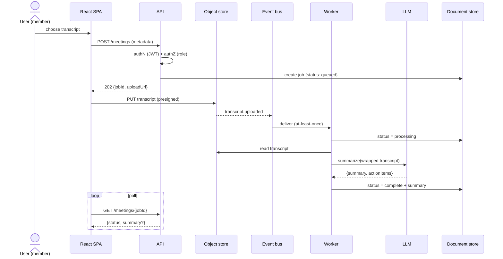
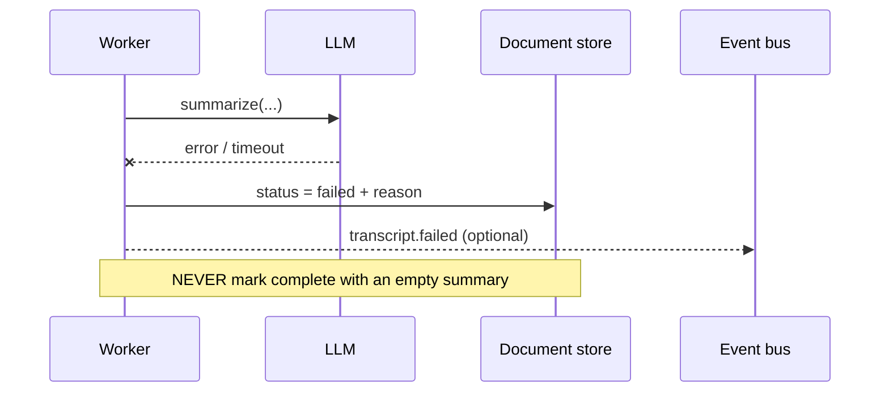
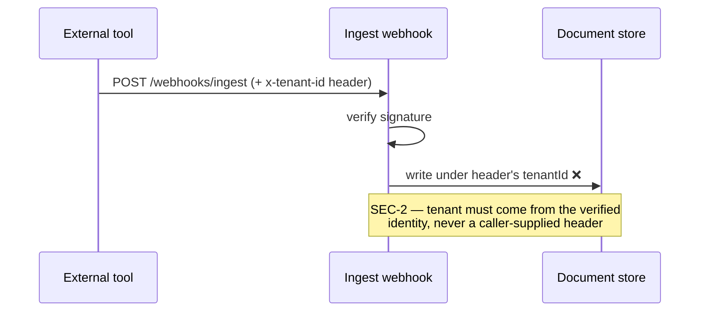

# 03 · Request & Event Flows

**In one paragraph.** The defining flow is asynchronous: uploading a transcript and getting a summary are two *different* interactions separated by a durable event. The API accepts the upload and returns immediately; a worker produces the summary later; the app polls for it. Understanding this one flow explains most of the system.

## Flow A — upload → summarize → view (happy path)

**Read it as:** the `POST` is cheap and synchronous (it just books the job); the summary appears later, delivered by the worker via the bus; the UI discovers it by polling. The `202` is the contract — "accepted, not done".

## Flow B — failure path (what *should* happen)

> **⚠️ Gotcha (this is `BE-1`):** the real worker `catch`es the LLM error and marks the job **complete** with a blank summary — so the scheduler sees success and the user sees nothing. The correct behavior is above: mark **failed**, record the reason, surface it. "Reported success without doing the work" is the highest-value class of bug an audit finds.

## Flow C — webhook ingest (the tenant-trust trap)

**Why it matters:** trusting `x-tenant-id` lets any signed caller write into *another* tenant's partition. Tenant must always be derived from a verified credential, never from request-controlled input.
