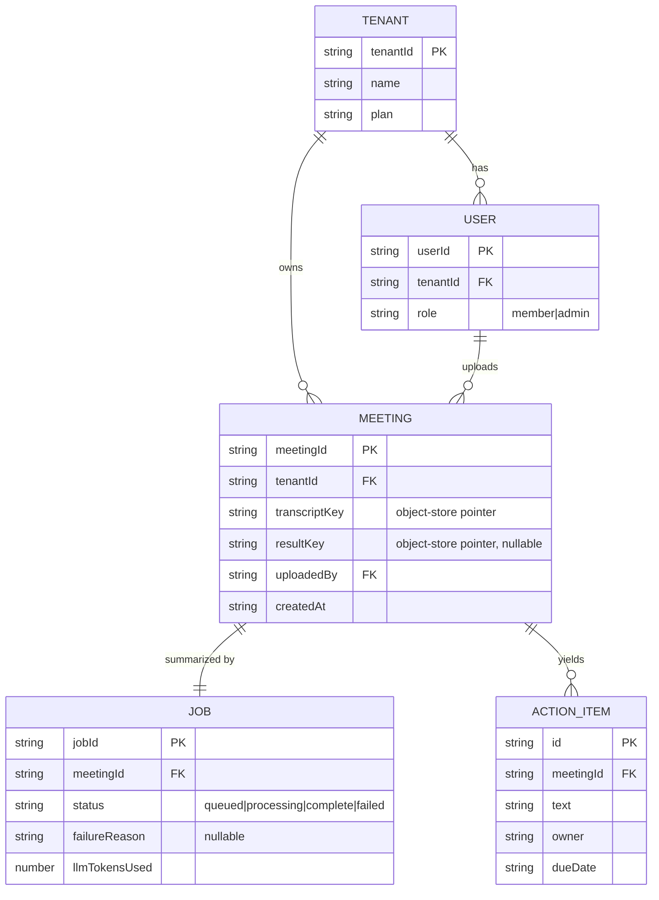

# 04 · Data Model

**In one paragraph.** Recapp uses a single-table document store for metadata and object storage for the large blobs (transcripts, generated results). Every item is partitioned by `tenantId` — that key *is* the tenant boundary, so it must always come from a verified identity. Transcripts and result JSON never live in the table (too big); the table holds pointers (object keys) to them.

## Entities

## Storage layout

| Data | Where | Key |
|------|-------|-----|
| Tenant / user / meeting / job metadata | Document store (single-table) | `PK = TENANT#{tenantId}`, `SK = MEETING#{meetingId}` / `JOB#{jobId}` |
| Raw transcript (large text) | Object store | `{tenantId}/transcripts/{meetingId}.txt` |
| Generated result JSON | Object store | `{tenantId}/results/{meetingId}.json` |

## Rules that keep it correct
- **`tenantId` prefixes every key.** A query is tenant-safe *only* because the partition key is `TENANT#{tenantId}` and `tenantId` came from the verified JWT. Fail-open resolution (`DATA-1`) breaks this.
- **Object keys are tenant-scoped too** (`{tenantId}/…`), so presigned URLs can't be pointed at another tenant's blob.
- **The job's status is a state machine:** `queued → processing → complete | failed`. Only the worker advances it, and `complete` must imply a real result exists (the `BE-1` bug violates this).

> **⚠️ Gotcha (this is `DATA-2`):** listing a tenant's meetings is a single Query with no pagination — it silently stops at the store's 1 MB page. Fine at 50 meetings, wrong at 5,000. Any list that can grow needs a `LastEvaluatedKey` loop.

## Scaling / integrity notes
- No cross-tenant global index should exist without a tenant filter — that's how leaks happen.
- The result JSON is the source of truth for the in-app view; the summary text is duplicated onto the `JOB`/`MEETING` item only as a convenience — keep them consistent or pick one.
