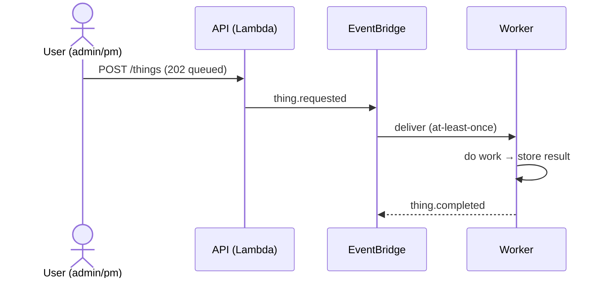

# Document a Codebase (Markdown → professional HTML site)

Produce documentation a new senior hire could read on day one and understand the system *intimately* — and a junior could follow without prior context. Ground everything in the real code with `path:line` citations. Never invent behavior; if unsure, read the code or say "unverified".

## Output location (always git-ignored)

Write to `local/recon/docs/` in the target repo:

```
local/recon/docs/
  md/            ← the chapters you write (NN-title.md)
  html/          ← generated site (build step creates this)
  build-html.mjs ← copy from this skill's assets/
```

If `local/` is not already ignored, exclude it locally without touching tracked files:
`printf 'local/\n' >> .git/info/exclude` (or add `local/` to `.gitignore` if the user wants it tracked-ignored).

## Process

### 1. Recon the codebase first
Before writing, build an accurate mental model. Read: the README(s), `package.json`/build files, the entry points, the route/handler registry, the data-model/schema files, the IaC (CDK/Terraform/k8s), the auth/RBAC layer, CI config, and the test tree (tests reveal intended behavior). Map the directories to responsibilities. Note the **dual paths** (e.g. local vs deployed) and where business logic actually lives. If an [[audit-codebase]] was already produced, read it — it tells you where reality and intent diverge.

### 2. Write the chapters
Default chapter set (drop/add to fit the system — keep the zero-padded numeric prefixes so ordering + the sidebar are automatic):

| File | Covers |
|------|--------|
| `00-glossary-and-adr-index.md` | Domain terms in plain English; index of architecture decisions |
| `01-system-overview.md` | What the product does, who uses it, the 30,000-ft picture + one context diagram |
| `02-architecture.md` | Components, boundaries, runtime topology, key patterns; component diagram |
| `03-request-flows.md` | Concrete end-to-end flows (sync request + async/event) as sequence diagrams |
| `04-data-model.md` | Entities, keys, relationships, storage layout; ER diagram + key tables |
| `05-domain-model-and-business-rules.md` | The rules that make the business correct (money math, state machines, invariants) |
| `06-backend.md` | Handler/service catalog, how a call is served, error handling, idempotency |
| `07-frontend.md` | App structure, routing, data fetching, state, auth wiring, error/empty states |
| `08-infrastructure-deployment-cicd.md` | IaC, environments, deploy pipeline, observability, cost |
| `09-ai-agents-and-knowledge-base.md` | (if applicable) models, prompts, gateways, evals, cost, safety |
| `10-security-rbac-tenancy.md` | AuthN/Z, roles, tenant isolation, secrets, network |
| `11-local-dev-ops-and-env-reference.md` | Run it locally, env vars, common ops, troubleshooting |

Also write `md/README.md` — a one-page "Documentation Home" that states scope, how to read, and links the chapters (it becomes `index.html`).

### 3. Quality bar (this is what makes it feel senior *and* junior-friendly)
- **Explain like the reader is smart but new.** Define a term the first time it appears. Prefer "why" over "what" — anyone can read the code for "what".
- **Every non-obvious claim is anchored** to `path/to/file.ts:123`. Cite the real file. This is the difference between documentation and fiction.
- **Lead each chapter with a short "In one paragraph" summary**, then go deep.
- **Show, don't assert.** Small, real code excerpts (5–15 lines) beat prose. Tables for catalogs (routes, entities, env vars, roles).
- **Call out the traps.** "Gotchas", failure modes, and the places the code surprises you get their own callouts (`> **⚠️ Gotcha:** …`).
- **Diagrams are mandatory** for architecture (component), each key flow (sequence), and the data model (ER). See below.
- Write in the present tense, active voice. No filler, no marketing.

### 4. Diagrams — use Mermaid fenced blocks
The build renders ```` ```mermaid ```` blocks in the browser. Use them liberally and correctly:

- **Architecture / components** → `flowchart LR` or `graph TD` with subgraphs for boundaries.
- **Request & event flows** → `sequenceDiagram` (one per important flow; show the async hop for event-driven paths).
- **Data model** → `erDiagram`.
- **State machines** (record lifecycle, approval flow) → `stateDiagram-v2`.

Keep each diagram focused (one idea). Label edges with the real message/verb. Example:

````

````

### 5. Build the HTML site
1. Copy this skill's `assets/build-html.mjs` to `local/recon/docs/build-html.mjs`.
2. Make `marked` available: from `local/recon/docs/`, run `npm i marked` (creates a tiny local `node_modules`), **or** vendor an ESM build to `local/recon/docs/html/assets/marked.esm.js` for fully-offline builds.
3. Build:
   ```bash
   cd local/recon/docs
   RECON_BRAND="ACME" RECON_TAG="Engineering Portal" node build-html.mjs
   ```
4. Open `local/recon/docs/html/index.html`. Mermaid loads from a vendored `html/assets/mermaid.min.js` if present, else a pinned CDN (needs network in the browser only). To go fully offline, drop `mermaid.min.js` into `html/assets/`.

The builder auto-discovers files, derives each page title from its first `# H1`, rewrites intra-doc `.md` links to `.html`, and builds the sidebar (Documentation group + Audit group if an `audit/` folder is present next to `docs/`). Re-run it any time the Markdown changes.

### 6. Report
Tell the user how many chapters + diagrams were produced, where the site is, and any areas you left marked "unverified" because the code didn't make them clear.

## Anti-patterns to avoid
- Documenting the *intended* design when the *code* does something else — document reality, note the divergence.
- Walls of prose with no diagrams, no code, no tables.
- Uncited claims. If you can't point to the code, don't assert it.
- Copy-pasting the code verbatim as "documentation" — explain the *why* and the *shape*, excerpt only what illustrates.
